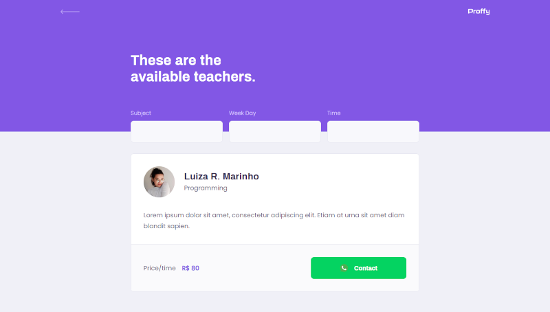

# Proffy
[(Next Level Week #2 by Rocketseat)](https://rocketseat.com.br/)

Study platform using *React* that connects teachers and students.

## Table of Contents
1. [Features](#features)
2. [Pages](#pages)
4. [My Diary](#my-diary)

## Features 
* Responsive Layout for mobile;
* Using `react-router-dom` to navigate between pages.

## Pages 
### Landing Page

### Teachers List Page

---

## My Diary 
### 1st Class
In this first class I learned a lot about CSS and that was where I had my first contact with React.

I can already say that I loved going deeper into the front-end!

I'm excited for the next classes!!!